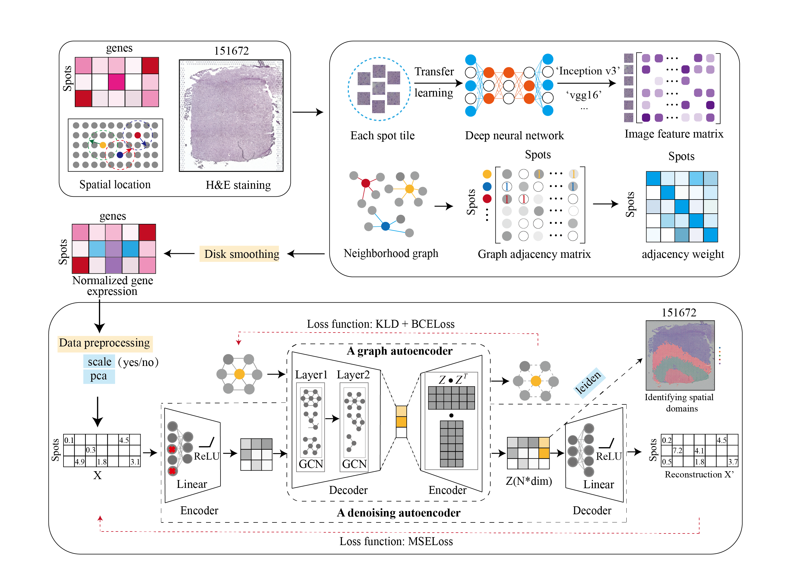

# STMAP: identify spatial domains in spatial transcriptomics




## Introduction
STMAP first uses H&E staining to extract tissue morphology information through a pre-trained deep learning model, and normalizes each spot’s gene expression according to the similarity of adjacent spots. STMAP further learns a spatial adjacency matrix on spatial location for the construction of graph convolutional network. STMAP utilizes a denoising autoencoder network and a variational graph autoencoder to generate the final latent embeddings. The output of STMAP can be applied to identify spatial domains, batch effect correction and downstream analysis.


## Compared tools
Tools that are compared include: 
* [BayesSpace](https://github.com/edward130603/BayesSpace)
* [stLearn](https://github.com/BiomedicalMachineLearning/stLearn)
* [SpaGCN](https://github.com/jianhuupenn/SpaGCN)
* [Seurat](https://satijalab.org/seurat/)
* [SEDR](https://github.com/JinmiaoChenLab/SEDR/)

### Download data
|      Platform      |       Tissue     |    SampleID   |
|:----------------:|:----------------:|:------------:|
| [10x Visium](https://support.10xgenomics.com) | Human dorsolateral pre-frontal cortex (DLPFC) | [151507,](https://spatial-dlpfc.s3.us-east-2.amazonaws.com/h5/151507_filtered_feature_bc_matrix.h5) [151508,](https://spatial-dlpfc.s3.us-east-2.amazonaws.com/h5/151508_filtered_feature_bc_matrix.h5) [151509,](https://spatial-dlpfc.s3.us-east-2.amazonaws.com/h5/151509_filtered_feature_bc_matrix.h5) [151510,](https://spatial-dlpfc.s3.us-east-2.amazonaws.com/h5/151510_filtered_feature_bc_matrix.h5) [151669,](https://spatial-dlpfc.s3.us-east-2.amazonaws.com/h5/151669_filtered_feature_bc_matrix.h5) [151670,](https://spatial-dlpfc.s3.us-east-2.amazonaws.com/h5/151570_filtered_feature_bc_matrix.h5) [151671,](https://spatial-dlpfc.s3.us-east-2.amazonaws.com/h5/151671_filtered_feature_bc_matrix.h5) [151672,](https://spatial-dlpfc.s3.us-east-2.amazonaws.com/h5/151672_filtered_feature_bc_matrix.h5) [151673,](https://spatial-dlpfc.s3.us-east-2.amazonaws.com/h5/151673_filtered_feature_bc_matrix.h5) [151674,](https://spatial-dlpfc.s3.us-east-2.amazonaws.com/h5/151674_filtered_feature_bc_matrix.h5) [151675,](https://spatial-dlpfc.s3.us-east-2.amazonaws.com/h5/151675_filtered_feature_bc_matrix.h5) [151676](https://spatial-dlpfc.s3.us-east-2.amazonaws.com/h5/151676_filtered_feature_bc_matrix.h5)
| [10x Visium](https://support.10xgenomics.com) | Mouse brain section| [Coronal,](https://www.10xgenomics.com/resources/datasets/mouse-kidney-section-coronal-1-standard-1-1-0) [Sagittal-Anterior,](https://www.10xgenomics.com/resources/datasets/mouse-brain-serial-section-1-sagittal-anterior-1-standard-1-1-0) [Sagittal-Posterior](https://www.10xgenomics.com/resources/datasets/mouse-brain-serial-section-1-sagittal-posterior-1-standard-1-1-0)
| [10x Visium](https://support.10xgenomics.com) | Human breast cancer| [Invasive Ductal Carcinoma breast,](https://www.10xgenomics.com/resources/datasets/human-breast-cancer-block-a-section-1-1-standard-1-1-0) [Ductal Carcinoma In Situ & Invasive Carcinoma](https://www.10xgenomics.com/resources/datasets/human-breast-cancer-ductal-carcinoma-in-situ-invasive-carcinoma-ffpe-1-standard-1-3-0) 
| [Stereo-Seq](https://www.biorxiv.org/content/10.1101/2021.01.17.427004v2) | Mouse olfactory bulb| [Olfactory bulb](https://github.com/BGIResearch/stereopy) 
| [Slide-seq](https://www.biorxiv.org/content/10.1101/2021.10.10.463829v1) |  Mouse hippocampus| [Coronal](https://www.spatialomics.org/SpatialDB/download/slideseq_30923225.tar.gz) 
| [MERFISH](https://www.pnas.org/content/116/39/19490) |  Mouse brain slice| [Hypothalamic preoptic region](https://www.spatialomics.org/SpatialDB/download/merfish_30385464.tar.gz) 


## Resources

+ On our [website](https://theislab.github.io/scib-reproducibility) we visualise the results of the study.

+ The reusable pipeline we used in the study can be found in the
  separate [scIB pipeline](https://github.com/theislab/scib-pipeline.git) repository. It is reproducible and automates
  the computation of preprocesssing combinations, integration methods and benchmarking metrics.

+ For reproducibility and visualisation we have a dedicated
  repository: [scib-reproducibility](https://github.com/theislab/scib-reproducibility).

### Please cite:

**Benchmarking atlas-level data integration in single-cell genomics.**
MD Luecken, M Büttner, K Chaichoompu, A Danese, M Interlandi, MF Mueller, DC Strobl, L Zappia, M Dugas, M Colomé-Tatché,
FJ Theis bioRxiv 2020.05.22.111161; doi: https://doi.org/10.1101/2020.05.22.111161_

## Package: `scIB`

We created the python package called `scIB` that uses `scanpy` to streamline the integration of single-cell datasets and
evaluate the results. The evaluation of integration quality is based on a number of metrics.

### Installation

The `scIB` python package is in the folder scIB. You can install it from the root of this repository using

```
pip install .
```

Alternatively, you can also install the package directly from GitHub via

```
pip install git+https://github.com/theislab/scib.git
```

Additionally, in order to run the R package `kBET`, you need to install it through R.

```R
devtools::install_github('theislab/kBET')
```

We recommend to use a conda environment or something similar, so that python and R dependencies are in one place. Please
also check out [scIB pipeline](https://github.com/theislab/scib-pipeline.git) for ready-to-use environments.

### Installing additional packages

This package contains code for running integration methods as well as for evaluating their output. However, due to
dependency clashes, `scIB` is only installed with the packages needed for the metrics. In order to use the integration
wrapper functions, we recommend to work with different environments for different methods, each with their own
installation of `scIB`. Check out the `Tools` section for a list of supported integration methods.

## Usage

The package contains several modules for the different steps of the integration and benchmarking pipeline. Functions for
the integration methods are in `scIB.integration`. The methods can be called using

```
scIB.integration.run<method>(adata, batch=<batch>)
```

where `<method>` is the name of the integration method and `<batch>` is the name of the batch column in `adata.obs`.

Some integration methods (scGEN, SCANVI) also use cell type labels as input. For these, you need to additionally provide
the corresponding label column.

```
runScGen(adata, batch=<batch>, cell_type=<cell_type>)
runScanvi(adata, batch=<batch>, labels=<cell_type>)
```

`scIB.preprocessing` contains methods for preprocessing of the data such as normalisation, scaling or highly variable
gene selection per batch. The metrics are located at `scIB.metrics`. To run multiple metrics in one run, use
the `scIB.metrics.metrics()` function.

### Metrics

For a detailed description of the metrics implemented in this package, please see
the [manuscript](https://www.biorxiv.org/content/10.1101/2020.05.22.111161v2).

#### Batch removal metrics include:

- Principal component regression `pcr_comparison()`
- Batch ASW `silhouette()`
- K-nearest neighbour batch effect `kBET()`
- Graph connectivity `graph_connectivity()`
- Graph iLISI `lisi_graph()`

#### Biological conservation metrics include:

- Normalised mutual information `nmi()`
- Adjusted Rand Index `ari()`
- Cell type ASW `silhouette_batch()`
- Isolated label score F1 `isolated_labels()`
- Isolated label score ASW `isolated_labels()`
- Cell cycle conservation `cell_cycle()`
- Highly variable gene conservation `hvg_overlap()`
- Trajectory conservation `trajectory_conservation()`
- Graph cLISI `lisi_graph()`

## Tools

Tools that are compared include:

- [BBKNN](https://github.com/Teichlab/bbknn) 1.3.9
- [Combat](https://scanpy.readthedocs.io/en/stable/api/scanpy.pp.combat.html) [paper](https://academic.oup.com/biostatistics/article/8/1/118/252073)
- [Conos](https://github.com/hms-dbmi/conos) 1.3.0
- [DESC](https://github.com/eleozzr/desc) 2.0.3
- [FastMNN](https://bioconductor.org/packages/batchelor/) (batchelor 1.4.0)
- [Harmony](https://github.com/immunogenomics/harmony) 1.0
- [LIGER](https://github.com/MacoskoLab/liger) 0.5.0
- [MNN](https://github.com/chriscainx/mnnpy) 0.1.9.5
- [SAUCIE](https://github.com/KrishnaswamyLab/SAUCIE)
- [Scanorama](https://github.com/brianhie/scanorama) 1.7.0
- [scANVI](https://github.com/chenlingantelope/HarmonizationSCANVI) (scVI 0.6.7)
- [scGen](https://github.com/theislab/scgen) 1.1.5
- [scVI](https://github.com/YosefLab/scVI) 0.6.7
- [Seurat v3](https://github.com/satijalab/seurat) 3.2.0 CCA (default) and RPCA
- [TrVae](https://github.com/theislab/trvae) 0.0.1
- [TrVaep](https://github.com/theislab/trvaep) 0.1.0

We tested SEDR on DLPFC dataset (12 slices) and compared it with 5 state-of-the 
art methods: 
* [BayesSpace](https://github.com/edward130603/BayesSpace)
* [Giotto](https://github.com/RubD/Giotto)
* [stLearn](https://github.com/BiomedicalMachineLearning/stLearn)
* [SpaGCN](https://github.com/jianhuupenn/SpaGCN)
* [Seurat](https://satijalab.org/seurat/)


Table of n_clsuters:
  
|Sample_ID|n_clusters|
| ------------- |:-------------:|
|151507|7|
|151508|7|
|151509|7|
|151510|7|
|151669|5|
|151670|5|
|151671|5|
|151672|5|
|151673|7|
|151674|7|
|151675|7|
|151676|7|

# scachepy
Caching extension for **Scanpy** and **Scvelo**. Useful when you want to make sure that your clustering, UMAP, etc. are always *exactly* the same, and enables you to share and load these attributes conveniently. Everything in an AnnData object can be cached using scachepy - if not implemented, we show in the [tutorial notebook](./notebooks/scachepy_tutorial.ipynb) how you can easily set up your own caching function. 

## Installation
```bash
pip install git+https://github.com/theislab/scachepy
```

## Usage
We recommend checking out the [tutorial notebook](./notebooks/scachepy_tutorial.ipynb). In essence, you can:
```python
import scachepy
c = scachepy.Cache(<directory>, separate_dirs=True, compression='lzma')

# set verbosity level
c.verbose(False)
# set whether to recache
c.force(True)

# view available functions
print(list(c.pl))

c.pp.pca(adata)
# also display and save some plots
c.pl.pca(adata)

# remove cached files
c.pp.clear()

# create a copy
adata_copy = c.pp.neighbors(adata, ..., copy=True)

# easily cache fields specified at runtime
# and override global settings
c.tl.louvain(adata, key_added='foo', force=False)
c.tl.louvain(adata, key_added='bar', verbose=True)

# and if you forgot to call the caching version of possibly
# long running function, we got you covered!
scv.tl.velocity_graph(adata, ...)
c.tl.velocity_graph(adata, ..., call=False)
...
```

# trVAE [](https://badge.fury.io/py/trVAE) [](https://travis-ci.org/theislab/trVAE) [](https://pepy.tech/project/trvae)

**Conditional out-of-distribution generation for unpaired data using transfer VAE [(Bioinformatics, 2020)](https://doi.org/10.1093/bioinformatics/btaa800).*

**Note: We have upgraded trVAE to a faster and more efficient implementation. Please refer to [Here](https://github.com/theislab/scarches)**


## Introduction
A Keras (tensorflow < 2.0) implementation of trVAE (transfer Variational Autoencoder) .

trVAE can be used for style transfer in images, predicting perturbations responses and batch-removal for single-cell RNA-seq.

* For pytorch implementation check [Here](https://github.com/theislab/trvaep)
## Getting Started

## Installation
Before installing trVAE package, we suggest you to create a new Python 3.6 (or 3.7) 
virtual env (or conda env) with the following steps:  

### 1.  Installing virtualenv
```bash
pip install virtualenv
```

### 2. Create a virtual with Python 3.6
```bash
virtualenv trvae-env --python=python3.6 
```

### 3. trVAE package installation
To install the latest version from PyPI, simply use the following bash script:
```bash
pip install trvae
```
or install the development version via pip: 
```bash
pip install git+https://github.com/theislab/trvae.git
```

or you can first install flit and clone this repository:
```bash
git clone https://github.com/theislab/trVAE
cd trVAE
pip install -r requirements
python setup.py install 
```

## Examples

* For perturbation prediction and batch-removal check this [example](https://nbviewer.jupyter.org/github/theislab/trVAE/blob/master/examples/trVAE_Haber.ipynb) from Haber et al.

## Reproducing paper results:
In order to reproduce paper results visit [here](https://github.com/Naghipourfar/trVAE_reproducibility).

## Reference
If you found trVAE useful please consider citing the published [manuscript.](https://academic.oup.com/bioinformatics/article/36/Supplement_2/i610/6055927) 


# scCODA - Single-cell differential composition analysis 
scCODA allows for identification of compositional changes in high-throughput sequencing count data, especially cell compositions from scRNA-seq.
It also provides a framework for integration of cell-type annotated data directly from [scanpy](https://scanpy.readthedocs.io/en/stable/) and other sources.
Aside from the scCODA model (Büttner, Ostner *et al* (2020)), the package also allows the easy application of other differential testing methods.


The statistical methodology and benchmarking performance are described in:
 
Büttner, Ostner *et al* (2020). **scCODA: A Bayesian model for compositional single-cell data analysis**
([*BioRxiv*](https://www.biorxiv.org/content/10.1101/2020.12.14.422688v1))

Code for reproducing the analysis from the paper is available [here](https://github.com/theislab/scCODA_reproducibility).

For further information on the scCODA package and model, please refer to the 
[documentation](https://sccoda.readthedocs.io/en/latest/) and the 
[tutorials](https://github.com/theislab/scCODA/blob/master/tutorials).

## Installation

Running the package requires a working Python environment (>=3.7).

This package uses the `tensorflow` (`==2.3.3`) and `tensorflow-probability` (`==0.11.0`) packages.
The GPU computation features of these packages have not been tested with scCODA and are thus not recommended.
    
**To install scCODA via pip, call**:

    pip install sccoda


**To install scCODA from source**:

- Navigate to the directory that you want to install scCODA in
- Clone the repository from Github (https://github.com/theislab/scCODA):

    `git clone https://github.com/theislab/scCODA`

- Navigate to the root directory of scCODA:

    `cd scCODA`

- Install dependencies::

    `pip install -r requirements.txt`

- Install the package:

    `python setup.py install`


## Usage

Import scCODA in a Python session via:

    import sccoda

**Tutorials**

scCODA provides a number of tutorials for various purposes. Please also visit the [documentation](https://sccoda.readthedocs.io/en/latest/) for further information on the statistical model, data structure and API.

- The ["getting started" tutorial](https://sccoda.readthedocs.io/en/latest/getting_started.html) provides a quick-start guide for using scCODA.

- In the [advanced tutorial](https://sccoda.readthedocs.io/en/latest/Modeling_options_and_result_analysis.html), options for model specification, diagnostics, and result interpretation are disccussed.

- The [data import and visualization tutorial](https://sccoda.readthedocs.io/en/latest/Data_import_and_visualization.html) focuses on loading data from different sources and visualizing their characteristics.

- The [tutorial on other methods](https://sccoda.readthedocs.io/en/latest/using_other_compositional_methods.html) explains how to apply other methods for differential abundance testing from within scCODA.


# zellkonverter

<!-- badges: start -->
[](https://www.tidyverse.org/lifecycle/#maturing)
[](https://bioconductor.org/packages/devel/bioc/html/zellkonverter.html)
[](https://bioconductor.org/packages/devel/bioc/html/zellkonverter.html)
[](https://codecov.io/gh/theislab/zellkonverter?branch=master)
<!-- badges: end -->

**zellkonverter** is a small package for converting between SingleCellExperiment
objects and alternative objects for storing single-cell RNA-sequencing data
(such as AnnData). It is built on top of the [**basilisk**][basilisk] package.

For documentation see please refer to [Bioconductor][bioc]. Development
documentation is also available on [Bioconductor devel][bioc-devel] or the
[pkgdown site][pkgdown].

## Installation

**zellkonverter** can be installed from Bioconductor using the **BiocManager**
package:

```r
if (!requireNamespace("BiocManager", quietly=TRUE)) {
    install.packages("BiocManager")
}
BiocManager::install("zellkonverter")
```

## Build status

|      Source      |       Checks     |    Updated   |
|:----------------:|:----------------:|:------------:|
| [Bioc release](http://bioconductor.org/packages/release/bioc/html/zellkonverter.html) | [](http://bioconductor.org/checkResults/release/bioc-LATEST/zellkonverter) |  |
| [Bioc devel](http://bioconductor.org/packages/devel/bioc/html/zellkonverter.html) | [](http://bioconductor.org/checkResults/devel/bioc-LATEST/zellkonverter) |  |
| [GitHub actions](https://github.com/theislab/zellkonverter/actions) | [](https://github.com/theislab/zellkonverter/actions) |  |

## Code of Conduct

Please note that the **zellkonverter** project is released with a
[Contributor Code of Conduct](https://contributor-covenant.org/version/2/0/CODE_OF_CONDUCT.html).
By contributing to this project, you agree to abide by its terms.

## Contributors

<a href="https://github.com/theislab/zellkonverter/graphs/contributors">
  
</a>

Made with [contributors-img](https://contrib.rocks).

[basilisk]: https://www.bioconductor.org/packages/basilisk/ "basilisk on Bioconductor"
[bioc]: https://bioconductor.org/packages/zellkonverter/ "zellkonverter on Bioconductor"
[bioc-devel]: https://bioconductor.org/packages/devel/bioc/html/zellkonverter.html "zellkonverter on Bioconductor devel"
[pkgdown]: https://theislab.github.io/zellkonverter/ "zellkonverter pkgdown site"


